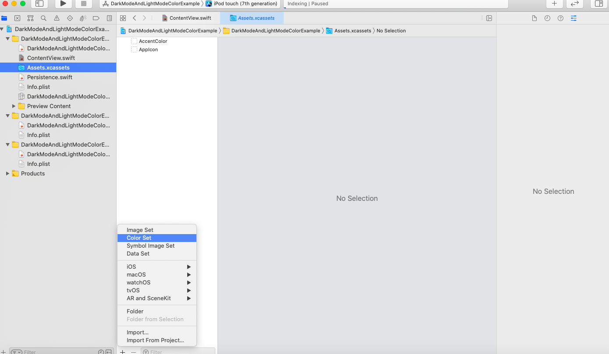
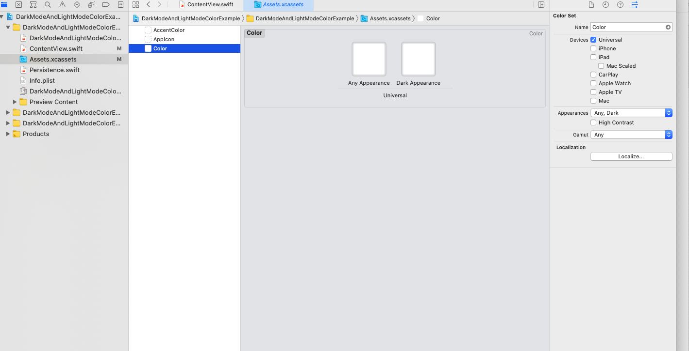
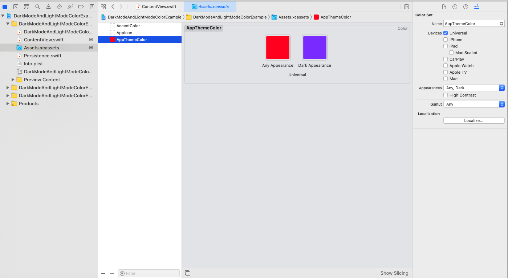

# DarkModeAndLightModeColorExample

Do you want to use different colors for the dark and light theme? If yes, then this example will help to understand it.

First, click on the plush bottom left plus icon see the screenshot for reference.

Then select color set, it will display color something like this, see screenshot for reference.

Now, add dark theme color on dark appearance and default color on any appearance.

To use the color use this code Color("AppThemeColor")

I hope this will help, Thank you

